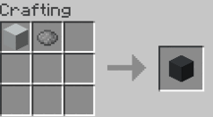

# DyeableConcrete
[DyeableConcrete on PlanetMinecraft](https://www.planetminecraft.com/data-pack/dyeableconcrete/)
 
[DyeableConcrete on Modrinth](https://modrinth.com/datapack/dyeableconcrete)
 
 
DyeableConcrete is a Minecraft datapack for versions 1.14-1.21.1 that lets you dye white concrete and white concrete powder the same way you dye white wool. To dye concrete or concrete powder, put white concrete or white concrete powder in the crafting grid with a dye.
 
 
 

